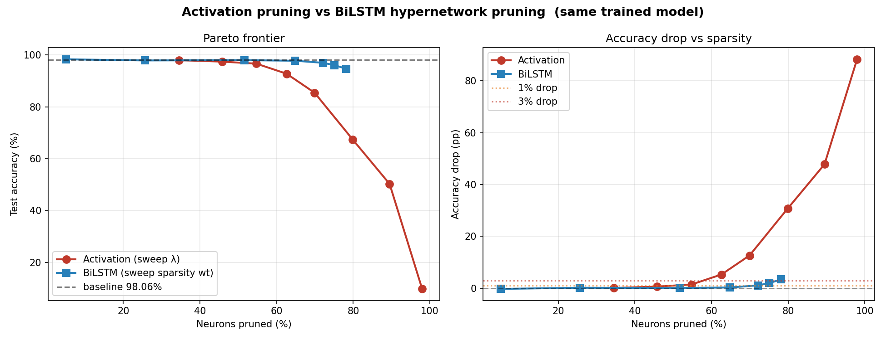
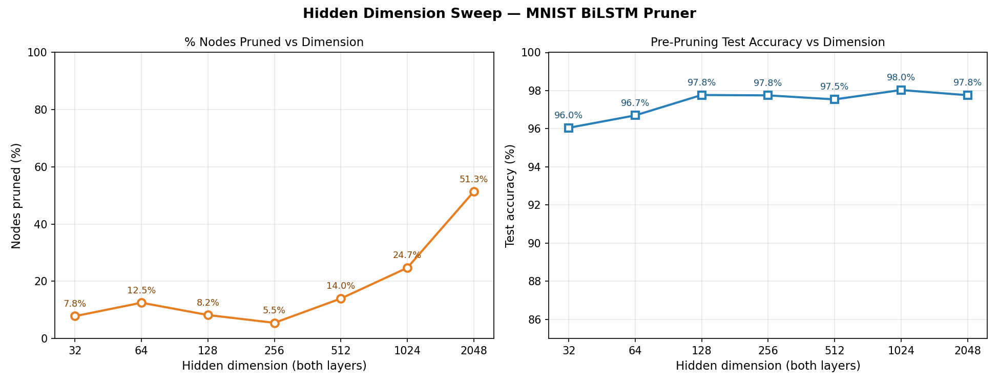
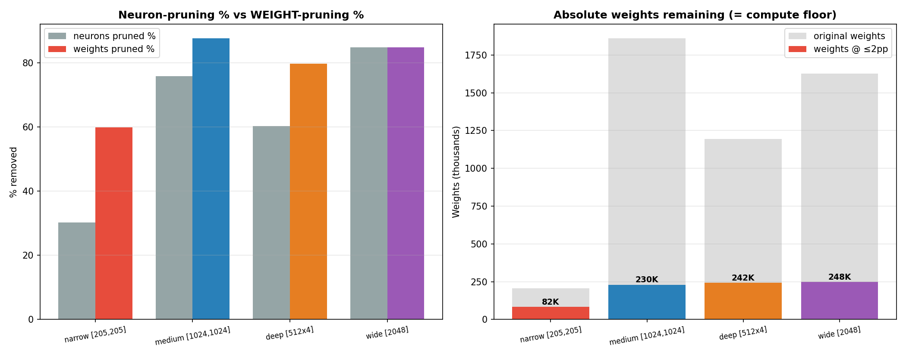
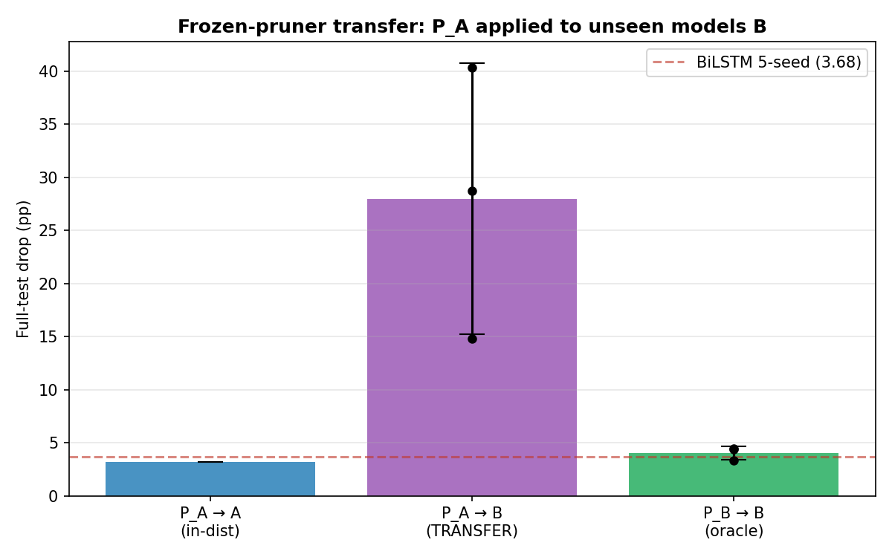
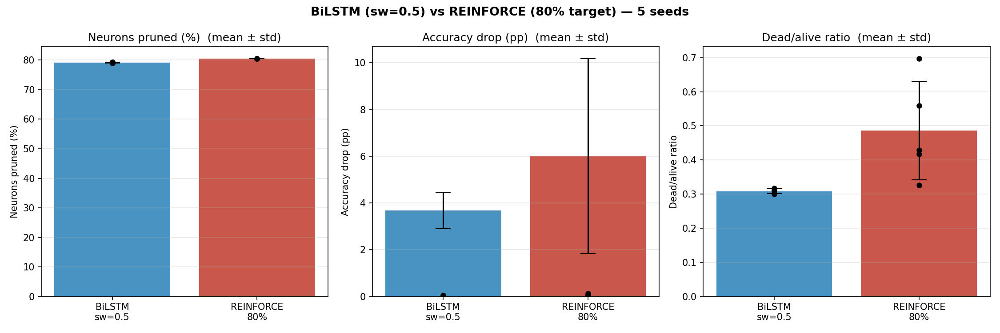
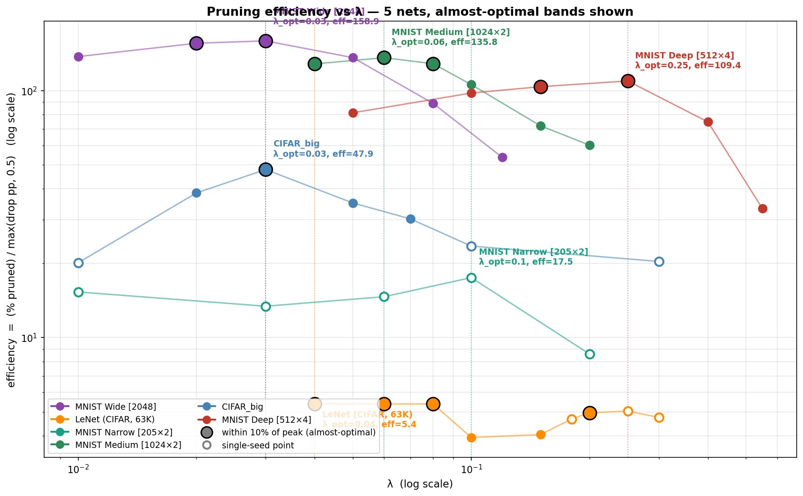
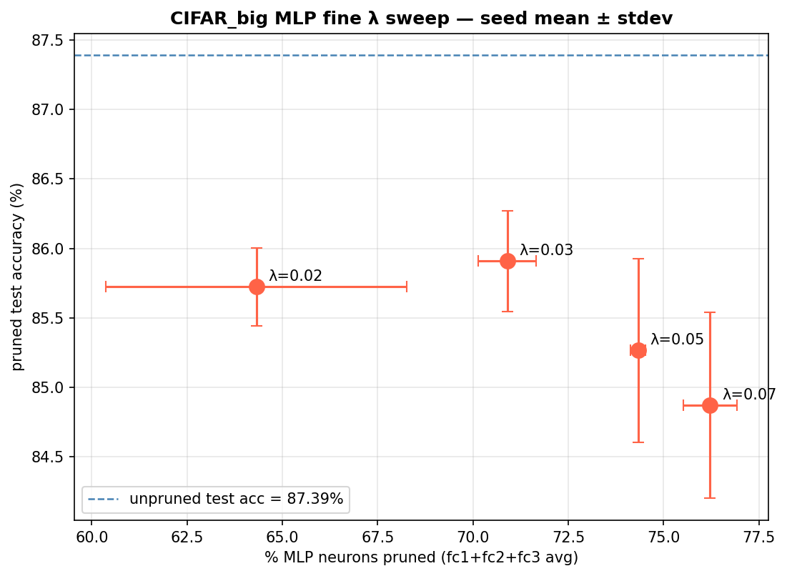

# Learned Efficiency Pruning

*A weight-conditioned hypernetwork that reads out a network's redundancy*

---

## Abstract

Most pruning methods decide *which* neurons to remove from data-dependent
statistics — activation magnitudes, gradient-based importance, or repeated
train–prune–retrain cycles. We take a different stance: we ask how much of a
trained network's redundancy is already written into its **weights**, and
whether a small learned model can read it out directly. **Learned Efficiency
Pruning (LEP)** is a weight-conditioned hypernetwork — a BiLSTM that consumes a
frozen network's weight matrices and emits a soft keep-gate per neuron, trained
end-to-end with the task loss and a single sparsity penalty $\lambda$. Across
MLP and convolutional-MLP-head architectures on MNIST and CIFAR-10, LEP prunes
60–85% of hidden neurons at small accuracy cost, does so near-deterministically
(the produced mask is a stable property of the weights), strictly dominates
classical magnitude/activation heuristics at every accuracy budget, and
provably dominates a reinforcement-learning formulation of the same problem.
The method also exposes a clean structural regularity — **prunability is set by
width, and weights (not neurons) are the conserved quantity** — that ties pruning
back to the lottery-ticket and effective-dimension literature. We close with the
research agenda this opens, including our intent to study LEP on the
feed-forward blocks of large language models.

---

## 1. Motivation and prior work

Network pruning has a long lineage. The classical recipe — train a dense
network, score parameters by **magnitude**, remove the smallest, and fine-tune —
goes back to Han et al. (2015) and remains the strongest simple baseline.
First-order methods (Molchanov et al., 2017) instead score a neuron by the
**Taylor estimate** of the loss change it would cause, i.e. by activation ×
gradient. The Lottery Ticket Hypothesis (Frankle & Carbin, 2019) reframed
pruning as the *discovery* of a sparse subnetwork that was trainable from
initialization, and Liu et al. (2019, "Rethinking the Value of Network Pruning")
argued that the pruned **architecture**, not the inherited weights, carries most
of the value.

Two properties unify almost all of this work. First, the importance signal is
**data-dependent**: you must push examples through the network to score a neuron.
Second, the scoring is **local and independent**: each neuron is ranked by a
scalar summary, and the interaction between neurons (and between layers) is
handled only implicitly through iterative retraining.

LEP changes both. We treat pruning as a **readout of redundancy that already
lives in the trained weights** rather than a fresh data-driven optimization, and
we make the mask producer a **separate, weight-conditioned model** that sees full
weight vectors and reasons jointly across neurons and layers. The question is no
longer "which neurons have small activations?" but "what does the *weight matrix*
tell us about how compressible this network is?"

---

## 2. Method: a weight-conditioned hypernetwork

### 2.1 Setup

Let $f_\theta$ be a trained classifier with frozen weights $\theta$. For each
prunable layer $\ell$ with weight matrix $W_\ell \in \mathbb{R}^{n_\ell \times
d_\ell}$, we treat **row $i$** (the fan-in weight vector of neuron $i$) as one
token. A hypernetwork $h_\phi$ reads these tokens and emits a logit $s_i$ per
neuron; a gate $g_i = \sigma(s_i) \in [0,1]$ multiplies that neuron's output.
The base network is never updated — only $\phi$ is trained.

### 2.2 Architecture

The encoder is a **bidirectional LSTM** that scans the rows of each layer, so the
score for neuron $i$ is informed by the entire population of weight vectors in
its layer (bidirectional context), not by $W_{\ell,i}$ in isolation. A small
per-layer **context head** summarizes each layer and is passed across layers,
giving the model a cross-layer view so it can allocate sparsity *between* layers,
not just within one. Stable training required a specific recipe, arrived at
empirically:

- **tanh-bounded cross-layer context** — the layer-allocation signal is squashed
  to $(-1,1)$ so no single layer can run away and starve another;
- **LayerNorm + gradient clipping** on the encoder;
- **final gate-layer bias initialized to $+2.0$** — every gate starts open, so
  pruning is a deliberate act of closing gates rather than the reverse;
- **zero-initialized context head** — the cross-layer signal starts neutral.

### 2.3 Objective

We minimize the task loss under a soft sparsity penalty:

$$
\mathcal{L}(\phi) \;=\; \mathbb{E}\big[\,\mathrm{CE}\big(f_{\theta \odot g_\phi}(x),\,y\big)\big]
\;+\; \lambda \cdot \frac{1}{L}\sum_{\ell=1}^{L} \bar{g}_\ell ,
$$

where $\bar g_\ell$ is the mean gate in layer $\ell$ and gates are binarized in
the forward pass with a straight-through estimator (STE). The single knob
$\lambda$ trades accuracy against sparsity. Crucially, because the $+2.0$ bias
holds scores near the STE's active band, **gradient reaches every neuron at
once** — the penalty is a smooth, global Lagrangian rather than a hard budget.
This turns out to matter (§4.3).

At inference, the hypernetwork needs **no data and no gradients**: it reads
$\theta$ and emits a mask.

---

## 3. Core results

All MNIST experiments use a $784\!\to\!1024\!\to\!1024\!\to\!10$ MLP
(baseline test accuracy 98.06%) unless stated; CIFAR experiments use a
convolutional backbone with an MLP head.

### 3.1 Weights alone encode redundancy, and the readout is deterministic

A pruner that sees only weights prunes **60–79%** of the MNIST MLP at
$<\!0.1$–$3.7$pp accuracy loss. Re-running the pruner from different seeds on the
*same* checkpoint produces essentially the same mask (alive/dead ratio
$\sigma = 0.007$). Redundancy is therefore not an artifact of a particular
training run of the pruner — it is a **fixed, readable property of the trained
weights**.

### 3.2 LEP strictly dominates classical heuristics

At every accuracy budget, the weight-conditioned readout prunes more than
activation- or magnitude-based scoring. At a $\leq\!1$pp accuracy-drop budget,
LEP removes ~72% of neurons versus ~46% for activation pruning.

*Figure 1. Accuracy vs fraction pruned for the same trained MNIST model.
Activation pruning collapses sharply past ~55% pruned (98.0%→85.5% at 70%
pruned), whereas LEP holds 98.0% accuracy at 52% pruned and only 2pp down at
75%. The gap is the value of scoring full weight vectors jointly rather than
scalar activation summaries independently.*

### 3.3 Bigger networks are more prunable

Sweeping hidden width on a fixed task, prunability rises monotonically with size:
a width-32 net yields ~8% prunable, width-1024 ~25%, width-2048 ~51% (at matched
penalty). This is exactly the over-parameterization story behind the lottery
ticket hypothesis, here read out directly by the pruner.

*Figure 2. Fraction pruned vs hidden dimension. Redundancy — and thus
prunability — scales with over-parameterization.*

### 3.4 Width is cheap, depth is load-bearing; weights are conserved

Holding the **neuron budget fixed at 2048** and varying shape reveals that
prunability is governed by **width, not depth or parameter count**: a single wide
layer $[2048]$ prunes to ~85%, the medium $[1024,1024]$ to ~76%, and a deep
$[512{\times}4]$ only to ~60% (all at iso-accuracy $\leq 2$pp, with pruners
retrained per configuration). Yet when measured in **weights rather than
neurons**, all three architectures converge to ~240K surviving weights — an
architecture-invariant compute floor for MNIST at this accuracy.

*Figure 3. Despite very different neuron-survivor counts across shapes
(314 / 490 / 814 for 1 / 2 / 4 layers), the surviving **weight** count lands near
~240K for all three 2048-neuron nets. Width is cheap parallel redundancy; depth
is sequential, load-bearing capacity. The conserved quantity is weights, not
neurons.*

Notably, pruning a large net down to this ~240K floor does **not** reach the true
minimum: a network *trained* small from scratch reaches comparable accuracy with
~3× fewer weights. Pruning recovers a redundant solution, not the minimal one —
consistent with Liu et al. (2019).

### 3.5 The method transfers; the mask does not

A pruner trained on network A, applied frozen to network B, is catastrophic
(~28pp drop). Retraining the *same architecture* of pruner on B recovers ~4pp.
Redundancy is real and findable in every network, but its **location is
idiosyncratic** to each network's weights (each lives in its own permutation
frame). LEP is a reliable *procedure*, not a portable *answer*.

*Figure 4. A frozen pruner transferred across networks performs far worse than
an oracle pruner retrained on the target — the redundancy structure does not
generalize, even though the method does.*

---

## 4. Analysis

### 4.1 Why a reinforcement-learning framing fails — and a theorem

Sequential pruning ("decide neuron by neuron") invites a reinforcement-learning
treatment, and we tested it thoroughly (REINFORCE, PPO, actor-critic, Bernoulli
policies, entropy and chunk-size variants). Every variant **matched or lost** to
the differentiable hypernetwork.

*Figure 5. Best-case RL (actor-critic) sits at $4.71\pm1.55$pp drop versus LEP's
$3.68\pm0.79$pp at ~80% pruned, with far higher variance.*

This is not a tuning failure — it is structural. On a **frozen** model the
per-step reward telescopes, so the episode return depends only on the *final set*
of kept neurons, not the order they were chosen. The pruning MDP therefore has a
**path-independent return**: it is static subset selection wearing a sequential
costume. A problem with path-independent return has no credit-assignment
structure for RL to exploit, so a direct differentiable optimizer provably
dominates. The one regime where this *doesn't* hold is pruning **during**
training, when the weights co-adapt to each masking decision and the return stops
telescoping — which is exactly where we point future work (§6).

### 4.2 The selection objective: soft global penalty beats hard budget

A natural "knob-free" alternative to $\lambda$ is a hard top-$K$ budget with an
STE. We implemented it carefully and found it **brittle and structurally
weaker**: even fully debugged it reaches only ~35% pruned at iso-accuracy versus
LEP's ~76% — roughly $2.6\times$ worse. The reason is general and worth stating:
a hard budget with a centered STE gives gradient only to the few neurons sitting
near the moving threshold (boundary-local), whereas the soft $\lambda$ penalty
keeps every neuron's gate in the active band and optimizes the **whole subset
jointly** (global gradient). *Removing a hyperparameter by switching to a hard
constraint trades a sweep for both a stability-guardrail stack and a worse
optimizer of the underlying selection problem.* Sweep-free is not the same as
better.

### 4.3 Choosing $\lambda$, and how it scales

$\lambda$ is the one knob, and its optimum is well-behaved. Across three base
networks spanning 165× in size and two datasets, the efficiency-optimal $\lambda$
stays in a narrow $[0.03, 0.06]$ band — it is **not** monotonic in model size.
The efficiency curve (fraction pruned per pp of accuracy lost) is a clean
inverted-U for wide nets and bimodal for narrow, saturated ones.

*Figure 6. Pruning efficiency vs $\lambda$ for LeNet (63K), MNIST MLP (1.86M),
and a large CIFAR net (10.4M). $\lambda_{\mathrm{opt}}$ stays in $[0.03,0.06]$
throughout; a candidate regularity $\lambda_{\mathrm{opt}}\cdot N_{\text{layers}}
\approx 0.10$ fits all three points and is cheap to falsify.*

### 4.4 Beyond MNIST

The findings hold on a convolutional network's MLP head on CIFAR-10: at the
Pareto knee the pruner removes ~71% of head neurons at ~1.5pp cost, and the
width→prunability pattern reappears *within a single network* — the widest layer
prunes hardest, while the last hidden layer before the output hits a load-bearing
floor it will not cross.

*Figure 7. CIFAR MLP-head pruning across $\lambda$. The per-layer allocation
mirrors the width/depth law: wide layers are compressed aggressively, the
narrow pre-output layer is preserved.*

---

## 5. Limitations

LEP characterizes redundancy in **fully-connected** structure (MLPs and MLP
heads); convolutional and attention layers are reached only indirectly so far.
The learned mask is network-specific and does not transfer (§3.5), so today the
method saves *inference* compute but not the cost of training a pruner per model.
The clean MDP-degeneracy result is specific to the **frozen** regime, and the
$\lambda$-scaling regularity is supported by three datapoints — suggestive, not
established. All accuracy numbers are at modest scale (MNIST/CIFAR-10).

---

## 6. Research directions

1. **Prune *during* training.** The single regime where the RL framing is not
   degenerate, because masking decisions feed back into co-adapting weights.
   This converts §4.1's negative result into a characterized boundary and is the
   natural home for any sequential method.
2. **A transferable redundancy detector.** Meta-train LEP over a *distribution*
   of networks using permutation-invariant features, directly testing whether the
   non-transfer of §3.5 is escapable. Success would turn the per-model pruner into
   a single reusable "redundancy reader."
3. **Prunability as an effective-dimension probe.** Treat the mask as an
   *instrument*: sweep data, width, depth, and training time and read prunability
   off as a proxy for effective dimension, tying it quantitatively to double
   descent and lottery tickets.
4. **Train-to-be-prunable.** A training-time regularizer that *concentrates*
   redundancy, flipping pruning from a post-hoc tool into an inductive bias.
5. **Scaling to large language models.** The MLP/feed-forward blocks of
   transformers are exactly the fully-connected structure LEP already handles, and
   they hold the majority of an LLM's parameters. We hope to study whether a
   weight-conditioned readout finds the same kind of width-concentrated,
   near-deterministic redundancy in FFN blocks — and whether a per-block
   $\lambda$ can deliver structured, inference-cheap sparsity at LLM scale. This
   is the direction we are most excited to pursue.

---

## 7. Conclusion

A trained network's redundancy is legible in its weights alone. A small
weight-conditioned hypernetwork reads it out near-deterministically, beats
classical heuristics at every budget, and provably outperforms a
reinforcement-learning treatment that is — on a frozen model — only static subset
selection in disguise. Along the way the method surfaces a structural law:
prunability tracks **width**, capacity tracks **depth**, and **weights**, not
neurons, are conserved. Learned Efficiency Pruning is therefore as much a
*measurement instrument* for over-parameterization as it is a compression tool —
and the instrument is ready to be pointed at large language models.
