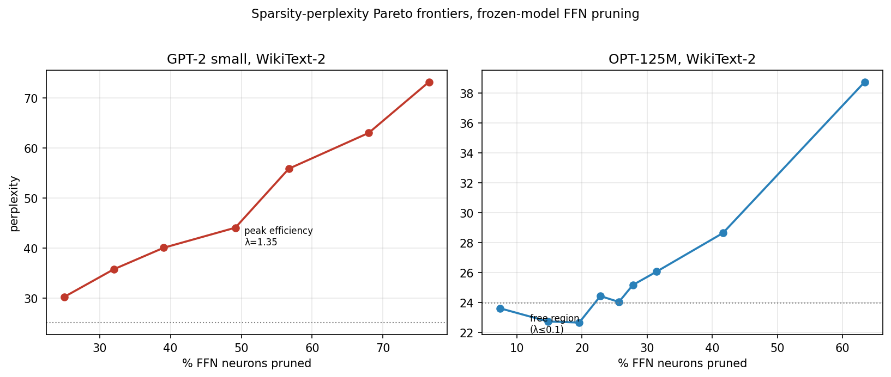
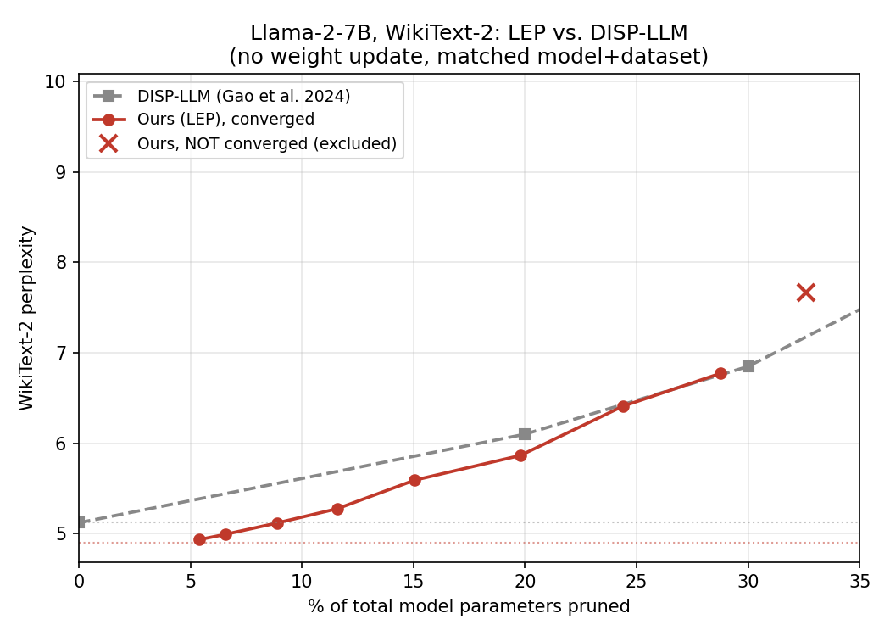

# Learned Efficiency Pruning

*A weight-conditioned hypernetwork for structured neuron pruning of frozen language models*

---

## Abstract

Structured pruning of large language models is usually driven by hand-designed,
data-dependent scoring rules — weight or activation magnitude, first-order
Taylor estimates, or one-shot calibration against a closed-form reconstruction
objective. These methods score neurons independently and layer-by-layer, with
no mechanism for one layer's redundancy to inform another's. We propose
**Learned Efficiency Pruning (LEP)**: a small hypernetwork — a per-neuron
weight-row encoder plus a bidirectional LSTM that shares context across
network depth — that reads a frozen, pretrained model's own weight matrices
and emits binary keep/prune gates for feed-forward neurons, trained
end-to-end against a soft sparsity penalty $\lambda$ on the frozen model's own
next-token loss. The base model is never fine-tuned, before or after pruning;
the deliverable is a smaller *effective* model at a controlled, characterized
accuracy cost, not an improved one.

A toy-scale pilot (MLPs on MNIST/CIFAR-10) establishes, qualitatively, that
weight matrices alone — no data, no gradients, no retraining — are sufficient
to find a highly compressible subnetwork, that the discovered mask is a
near-deterministic property of the trained weights, and that prunability
tracks layer width rather than depth. At LLM scale, the same architecture and
hyperparameters, unmodified beyond the weight-extraction plumbing, port across
GPT-2 small, OPT-125M, Mistral-7B, and Llama-2-7B. On GPT-2 and OPT-125M we
report clean sparsity-perplexity Pareto frontiers and show the learned pruner
cuts perplexity cost by roughly $6\times$ versus a matched-sparsity
activation-magnitude baseline. At 7B scale we validate directly against a
recently published trained-hypernetwork baseline, DISP-LLM (Gao et al.,
2024): on Llama-2-7B/WikiText-2, the exact model and dataset DISP-LLM reports
its own headline numbers on, LEP beats DISP-LLM's published perplexity at
every converged operating point from 5% to 29% of total model parameters
pruned. This advantage does not fully transfer to downstream zero-shot
accuracy, however: LEP is at parity with DISP-LLM through roughly 9% of
parameters pruned but falls up to 3.0 points behind at the highest sparsity
we test, a divergence we report and discuss rather than omit. We also report
an honestly diagnosed failure mode — one high-sparsity operating point that
does not converge — and the mechanism we believe is responsible, rather than
omitting it.

---

## 1. Introduction

Large language models are expensive to serve. Structured sparsity — removing
whole neurons, attention heads, or channels rather than scattering
unstructured zeros through a weight matrix — is the form of compression that
actually converts into wall-clock and memory savings on commodity hardware,
unlike unstructured magnitude pruning, which typically needs specialized
sparse kernels to realize any speedup at all (Frantar & Alistarh, 2023; Sun
et al., 2023).

Most structured-pruning methods for LLMs share two properties. First, the
importance signal is a **hand-designed, local rule**: weight magnitude,
activation magnitude (Hu et al., 2016), a first-order Taylor estimate
(Molchanov et al., 2017; Ma et al., 2023), or a closed-form layerwise
reconstruction objective (Frantar & Alistarh, 2023; Sun et al., 2023; Guo et
al., 2025). Second, that signal is computed **independently per neuron**, with
cross-layer interaction handled only implicitly, if at all, through a
uniform or heuristically-tuned per-layer budget. A small number of recent
methods instead *learn* the scoring function via gradient descent — most
notably DISP-LLM (Gao et al., 2024), which trains a hypernetwork to set
per-layer widths — but this remains rare, and the learned methods that do
exist do not condition their scoring jointly on the full weight vector of
every neuron together with an explicit, depth-aware sharing mechanism between
layers.

We take the position that a trained network's redundancy structure is
already legible in its weights, and that the right question is not "which
neurons have small activations on this calibration set" but "what does the
weight matrix itself say about how compressible this network is." LEP
answers this with a hypernetwork that (a) scores each neuron from its own
weight row via a shared, permutation-respecting encoder, and (b) shares that
information across the depth axis via a bidirectional LSTM, so a layer's
implied redundancy can be informed by every other layer's before gates are
decided. The pruner is trained end-to-end against the frozen base model's own
loss, with a single sparsity penalty $\lambda$ as the only knob — no external
labels beyond next-token prediction, no calibration set beyond the pruner's
own training batches, and no architecture-specific tuning needed to port the
same code across four different base models spanning three orders of
magnitude in parameter count.

**Contributions.**

1. A weight-conditioned hypernetwork architecture (row-encoder + bidirectional
   cross-layer context) for structured neuron pruning of frozen networks,
   with a proved permutation-equivariance guarantee (§3.3).
2. A toy-scale pilot connecting the method to the Lottery Ticket Hypothesis
   (Frankle & Carbin, 2019): weights alone, without data or gradients or
   retraining, are sufficient to discover a highly compressible subnetwork.
3. Clean, reconciled sparsity-perplexity Pareto frontiers on GPT-2 small and
   OPT-125M, an efficiency metric characterizing the frontier's best
   operating point, and a $\sim\!6\times$ perplexity-cost improvement over a
   matched-sparsity activation-magnitude baseline.
4. A direct, head-to-head comparison against a recent trained-hypernetwork
   baseline (DISP-LLM) on the exact model and dataset it reports its own
   numbers on — Llama-2-7B, WikiText-2 — where LEP beats the published curve
   at every converged operating point, together with an honest diagnosis of
   the one operating point where it currently does not.

---

## 2. Related Work

**Lottery Ticket Hypothesis.** Frankle & Carbin (2019) show that dense,
randomly-initialized networks contain sparse subnetworks that, trained in
isolation from the *same* initialization, match the dense network's accuracy.
Liu et al. (2019, "Rethinking the Value of Network Pruning") complicate this
by showing the pruned *architecture*, not the specific inherited weights,
often carries most of the value. Our toy-scale pilot (§4) connects to this
literature but differs mechanically: we never retrain or rewind — the mask
is read directly off the trained weights by a learned scorer — and we care
about frozen-model *inference-time* sparsity, not *trainability from a
lottery-ticket initialization*.

**Classical structured-pruning scoring rules.** Magnitude pruning (Han et
al., 2015) remains the strongest simple baseline; activation-magnitude/APoZ
scoring (Hu et al., 2016) and first-order Taylor-expansion importance
(Molchanov et al., 2017; Ma et al., 2023) are the next step up in
sophistication. All three score neurons independently, with no learned
cross-layer interaction — this is the baseline family §5.4's comparison is
measured against.

**One-shot / calibration-based LLM pruning.** SparseGPT (Frantar & Alistarh,
2023) and Wanda (Sun et al., 2023) prune in a single forward pass via a
closed-form layerwise reconstruction objective, with no training loop at all
— SparseGPT reports up to 60% *unstructured* sparsity on OPT-175B at
"comparable" perplexity (its own reported 50%-sparsity point is, in fact,
slightly *below* the dense baseline: 8.35 → 8.21 ppl on raw-WikiText2), and
Wanda matches this quality at roughly $300\times$ lower scoring cost by
dropping the weight-update step entirely. LLM-Pruner (Ma et al., 2023) scores
weights via a first-order Taylor expansion and recovers performance with
LoRA fine-tuning; FLAP (An et al., 2023) is retraining-free, scoring by
input-fluctuation stability. SlimLLM (Guo et al., 2025) evaluates channel and
attention-head importance holistically (Pearson similarity between original
and pruned-layer outputs) rather than by aggregating per-weight scores, and
recovers performance with a fast linear-regression repair of the output
matrix; its headline "98.7% of original performance retained" figure is
*downstream commonsense-reasoning accuracy with post-pruning LoRA tuning
applied* — the directly comparable, tuning-free number in the same table is
96.8%. GISP (Wang et al., 2025) globally (not per-layer) prunes attention
heads and MLP channels via an iterative, block-normalized first-order
importance signal, and is, to our knowledge, the only prior structured-LLM-
pruning work reporting numbers on both Llama-3-8B and Mistral-7B — the exact
models this paper also validates on (§6). SDS (Li et al., 2024) reconstructs
weights between two one-shot semi-structured (2:4) prune passes and reports
near-full dense recovery at that sparsity pattern on OPT-125M. None of these
methods train a scoring network; all are calibration-based, whether
closed-form or iterative.

**Learned, trained-mask pruning.** CoFi (Xia et al., 2022) and $L_0$
regularization (Louizos et al., 2017) jointly learn coarse- and fine-grained
binary masks via a relaxed $L_0$ penalty, evaluated on BERT-scale
classification tasks, not autoregressive LLMs. Closest to our own method is
**DISP-LLM** (Gao et al., 2024), which trains a hypernetwork (a
GRU$\to$LayerNorm$\to$GeLU$\to$Linear stack) via gradient descent (using the
ReinMax straight-through estimator) to set per-layer widths for both
attention and MLP structures jointly, without updating the base model's
weights — architecturally the closest analogue to LEP in the literature we
are aware of. Two differences are load-bearing for the comparison in §6.3:
DISP-LLM's training objective is the pruned model's own language-modeling
loss alone (no paired forward pass through the unpruned model), and it prunes
across attention *and* MLP structures jointly, a strictly broader scope than
LEP's FFN-only pruning. DISP-LLM also trains for a fixed 10,000 iterations
per (model, target-sparsity) pair regardless of difficulty, versus LEP's
convergence-based, difficulty-adaptive stopping rule (§3.6) — see §6.3 for
the resulting compute comparison. Structured channel pruning via a trained
meta-network has precedent in the CNN literature (Network Slimming, Liu et
al., 2017; MetaPruning, Liu et al., 2019) but is not evaluated here; our
scope is LLM feed-forward blocks.

**Reinforcement learning and hard-budget formulations.** We considered and
rejected two alternative formulations during development. A sequential,
RL-based pruning policy is provably dominated by direct differentiable
optimization on a frozen model: because the per-step reward telescopes, the
episode return depends only on the *final* set of kept neurons, not the order
they were chosen, so the induced MDP has path-independent return and no
credit-assignment structure for RL to exploit. A hard top-$K$ budget with a
straight-through estimator gives gradient only to neurons near the moving
threshold and is both less stable and substantially weaker at matched
accuracy than the soft $\lambda$-penalty formulation used throughout this
paper. Neither is discussed further.

---

## 3. Method

### 3.1 Problem setup

Let $f_\theta$ be a frozen, pretrained language model; $\theta$ is never
updated, before or after pruning. A pruner $g_\phi$ reads $f_\theta$'s own
weight matrices and outputs per-neuron binary gates $m$. The objective is to
find $\phi$ minimizing task loss on the gated model $f_\theta(x; m)$ subject
to a sparsity penalty on $m$. The deliverable is the pair $(\theta, m)$ — a
smaller effective model — not a better $\theta$. This paper does not claim,
anywhere, that pruning improves the base model; §7.2 explains why an early,
now-corrected result once looked like it did.

### 3.2 Pruner architecture

For each prunable layer $\ell$, let $W_\ell \in \mathbb{R}^{n_\ell \times
d_\ell}$ be the weight matrix whose rows are treated as one token per neuron.
A **row encoder** — a shared 2-layer MLP, $\mathrm{Linear}(d_\ell,
\mathrm{embed\_dim}) \to \mathrm{ReLU} \to \mathrm{Linear}(\mathrm{embed\_dim},
1)$, applied identically to every row — maps each neuron's weight vector to a
scalar logit. The output bias is initialized to $+2.0$, so every gate starts
near-fully-open: pruning is learned in, not defaulted. In parallel, each
layer's weight matrix is summarized by a mean over the neuron axis and
projected to a shared hidden size, and the resulting per-layer embeddings are
run through a **bidirectional LSTM** over the depth sequence. The LSTM's
output, passed through $\tanh$ (bounding it to $(-1,1)$ so it can *modulate*
but never override the per-neuron logit) and a small linear head, is added
back to every neuron's logit in that layer as a cross-layer context bias.
Gates are produced with a straight-through estimator: hard threshold at $0.5$
in the forward pass, sigmoid gradient in the backward pass. The same
architecture and hyperparameters ($\mathrm{embed\_dim}=64$,
$\mathrm{lstm\_hidden}=128$) are reused, unmodified beyond the
weight-extraction plumbing, across every base model in this paper — MLP
hidden layers, a CIFAR conv-net's FC head, GPT-2's Conv1D FFN, OPT-125M's
`nn.Linear` FFN, and the SwiGLU FFN blocks of Mistral-7B and Llama-2-7B (§6).

### 3.3 Permutation equivariance

Neurons within one layer have no canonical order: any permutation of a
layer's rows, with the matching permutation applied downstream, computes an
identical function. A pruning criterion that is not invariant to this
symmetry is fitting an artifact of storage order rather than the network's
actual redundancy structure. The row encoder is exactly invariant to this
symmetry by construction — it is one shared function $h: \mathbb{R}^{d_\ell}
\to \mathbb{R}$ applied independently per row, so permuting the rows just
permutes which score goes with which row, and the layer-context summary
($\mathrm{mean}$ over the neuron axis) is likewise permutation-invariant.

**Lemma (permutation equivariance).** For any permutation matrix $P$ acting
on layer $\ell$'s neuron axis, $g_\phi(PW_\ell) = P \cdot g_\phi(W_\ell)$.

*Proof sketch.* The row encoder $h$ is applied row-wise and identically to
every row, so $h(PW_\ell) = P\,h(W_\ell)$ directly. The layer-context term
depends on $W_\ell$ only through $\mathrm{mean}_i(W_{\ell,i})$, which is
invariant to any permutation of the row index $i$; it therefore contributes
an identical additive bias to every row regardless of $P$. The gate function
is a fixed, row-wise nonlinearity of the sum of these two terms, so it
commutes with $P$ as well. $\blacksquare$

This is a structural guarantee, not a trained-in behavior. It also rules out
one candidate explanation for a limitation we discuss in §7.3 (a trained
pruner does not transfer across independently-trained networks): the failure
is not a missing permutation invariance, since the invariance is already
exact.

### 3.4 Why a sequence model over depth, and not over neurons

Depth, unlike within-layer neuron order, is a genuine, non-arbitrary axis:
layer $\ell$'s output literally feeds layer $\ell{+}1$. A sequence model over
the depth axis is therefore the structurally appropriate choice, in direct
contrast to a sequence model over neurons-within-a-layer, which would impose
a false order onto a permutation-symmetric set — exactly the mistake §3.3
rules out for the row encoder. The bidirectional LSTM lets a layer's implied
sparsity budget depend on the redundancy profile of every other layer in
both directions: a layer with unusually concentrated redundancy can inform
neighboring layers that they can be pruned harder without creating a
capacity bottleneck. Our toy-scale pilot (§4) motivates this design directly
— prunability tracks layer width, and a pruner that cannot see across layers
cannot discover that asymmetry.

### 3.5 Training objective

$$
\mathcal{L}(\phi) = \big(\mathrm{CE}_{\text{pruned}} - \mathrm{CE}_{\text{orig}}\big) + \lambda \cdot \frac{1}{L}\sum_{\ell=1}^{L} \bar{g}_\ell,
$$

where $\mathrm{CE}_{\text{orig}}$ and $\mathrm{CE}_{\text{pruned}}$ are the
frozen base model's cross-entropy loss on the same batch with all gates open
and with the current gates applied, respectively, and $\bar g_\ell$ is the
mean gate value in layer $\ell$ (so the penalty decreases as sparsity
increases). Only $\phi$ receives gradients; the frozen model's forward pass
runs twice per step, once ungated and once gated. $\lambda$ is the sole knob
controlling the sparsity/accuracy operating point and is swept externally
(§3.7).

We flag one open methodological question rather than resolving it silently:
as written, the loss has no floor at zero, so gradient descent is free to
push $\mathrm{CE}_{\text{pruned}}$ *below* $\mathrm{CE}_{\text{orig}}$ if the
training distribution allows it. §7.2 discusses exactly this happening early
in this project's OPT-125M experiments, why it does not reflect a genuine
capability improvement, and why we report it as a cautionary methodological
finding rather than retroactively re-running every checkpoint against a
floored objective, `max(CE_pruned − CE_orig, 0)`. All results in this paper
use the unfloored objective as written above.

### 3.6 Convergence-based stopping and plateau-triggered learning-rate decay

Rather than a fixed step budget — which we found to be badly and
non-uniformly mismatched to actual convergence across $\lambda$ and models —
training stops via a block-mean flatness check: every `check_every` steps,
the mean gate value per layer over the trailing block is compared against
the same statistic at `window` prior checkpoints, and training is declared
converged if every layer's block-mean is within a relative/absolute
tolerance across the whole window. A raw convergence signal is not trusted
immediately: it triggers a cosine learning-rate decay
($\mathrm{lr}_0 \to \mathrm{lr}_{\min}$ over a fixed window), and only a
*second* flatness check, evaluated once the decay window has elapsed, confirms
convergence. If the reconfirmation fails, the run holds at $\mathrm{lr}_{\min}$
and continues — this correctly distinguishes a genuine plateau from a
noisy trajectory that happened to look flat over one window (§6.4 discusses
one operating point where this mechanism still does not resolve a genuine,
persistent instability).

### 3.7 $\lambda$ sweep, Pareto curve, and efficiency metric

$\lambda$ is swept on a grid (typically log-spaced) per base model, 2 seeds
per point at GPT-2/OPT-125M scale where compute allowed, 1 seed at 7B scale.
We report the full **Pareto curve** — percent of neurons (or, where directly
comparable to prior work, percent of total model parameters) pruned versus
pruned-model perplexity, against the unpruned baseline as a reference line —
alongside a single-number **efficiency metric**,

$$
\mathrm{efficiency}(\lambda) = \frac{\%\,\text{pruned}}{\exp(\Delta\mathrm{CE})}, \qquad \Delta\mathrm{CE} = \ln\!\Big(\frac{\mathrm{ppl}_{\text{pruned}}}{\mathrm{ppl}_{\text{orig}}}\Big),
$$

which converts the nats-scale cost back to a perplexity-ratio scale so it is
comparable across models and datasets with different baseline cross-entropy.
We use this to identify a recommended operating point, while reporting the
full curve alongside it since the efficiency peak is typically a broad
plateau, not a sharp optimum.

---

## 4. Toy-Scale Pilot: Motivating Evidence

Before scaling to language models, we ran a pilot on small MLPs (MNIST) and a
convolutional network's fully-connected head (CIFAR-10). We report this
section qualitatively only — no sparsity percentages, accuracy-drop figures,
or weight-count numbers — since these toy-scale results exist to motivate
the hypotheses tested for real at LLM scale (§5-§6), not as this paper's
empirical content.

Four qualitative regularities motivated the design in §3. First, **weights
alone are sufficient to find a good mask**: no data, no gradients, and no
retraining cycle are needed to discover a highly compressible subnetwork
directly from a trained model's weight matrices — a stronger claim than the
classical Lottery Ticket Hypothesis's iterative reinitialize-and-retrain
procedure (Frankle & Carbin, 2019), since here the mask is read off directly.
Second, **the discovered mask is a near-deterministic property of the
trained weights**, not an artifact of the pruner's own random
initialization or training noise — supporting the reading that "prunability"
is a real, measurable property of the base network rather than
measurement noise. Third, **the learned pruner dominates classical scoring
rules at every accuracy budget tested**, because it conditions on the full
weight vector rather than a hand-designed scalar summary — the toy-scale
precedent for §5.4's LLM-scale baseline comparison. Fourth, **prunability is
governed by layer width, not depth or raw parameter count**: wide layers
concentrate redundancy, while depth behaves as load-bearing capacity that
resists pruning — directly motivating §3.4's cross-layer context design,
since a pruner that cannot see across layers cannot discover this asymmetry.

---

## 5. LLM-Scale Experiments

### 5.1 Setup

We prune the FFN intermediate neurons of frozen GPT-2 small and OPT-125M
(both 12 layers, hidden size 768, architecturally compute-equivalent),
training and evaluating on WikiText-2 with a standard sliding-window
cross-entropy evaluation protocol (2048-token windows, 1024-token stride),
using the same pruner architecture and hyperparameters as the toy-scale
pilot with no per-model tuning beyond the weight-extraction plumbing.

### 5.2 GPT-2 small

*Figure 1. Sparsity-perplexity Pareto frontiers for GPT-2 small and
OPT-125M, WikiText-2, frozen-model FFN pruning.*

A $\lambda = 0.01 \to 3.2$ sweep (2 seeds per point) gives a clean,
monotonically increasing cost curve across the entire range — no free-lunch
region, no crossover with the dense baseline (dense ppl $= 25.109$). Table 1
reports the mean over seeds at each $\lambda$; peak efficiency (§3.7) falls
at $\lambda = 1.35$ (49.16% pruned, ppl $44.075 \pm 1.94$), with a broad
plateau from roughly $\lambda = 0.75$ to $\lambda = 2.4$.

**Table 1. GPT-2 small, WikiText-2, mean over 2 seeds (dense ppl $=25.109$).**

| $\lambda$ | % pruned | pruned ppl | $\Delta$ppl |
|---|---|---|---|
| 0.55 | 25.01% | 30.253 | +5.14 |
| 0.75 | 32.00% | 35.766 | +10.66 |
| 1.0  | 39.05% | 40.064 | +14.96 |
| **1.35** | **49.16%** | **44.075** | **+18.97 (peak efficiency)** |
| 1.8  | 56.71% | 55.862 | +30.75 |
| 2.4  | 67.99% | 63.013 | +37.90 |
| 3.2  | 76.50% | 73.201 | +48.09 |

### 5.3 OPT-125M

A 9-point, convergence-based sweep (dense ppl $=23.941$; single seed,
convergence-based stopping per §3.6 rather than a fixed step budget) gives a
qualitatively similar shape, with one wrinkle worth flagging plainly rather
than hiding: at the three lowest $\lambda$ values ($\leq 0.1$), the measured
pruned-model perplexity is at or slightly *below* the dense baseline. We do
not read this as pruning improving the model — §7.2 explains the mechanism
(an unfloored loss term combined with WikiText-2's own correlated train/test
split can produce exactly this signature, and it does not survive an
out-of-domain check) and why we still report the raw numbers rather than
adjust them. The genuine, monotonic cost region begins by $\lambda = 0.2$.

**Table 2. OPT-125M, WikiText-2, single seed, convergence-based stopping (dense ppl $=23.941$).**

| $\lambda$ | % pruned | pruned ppl | $\Delta$ppl |
|---|---|---|---|
| 0.01 | 7.41%  | 23.603 | $-0.34$ (see §7.2) |
| 0.05 | 14.75% | 22.723 | $-1.22$ (see §7.2) |
| 0.1  | 19.56% | 22.648 | $-1.29$ (see §7.2) |
| 0.2  | 22.81% | 24.422 | +0.48 |
| 0.25 | 25.66% | 24.027 | +0.09 |
| 0.3  | 27.79% | 25.160 | +1.22 |
| 0.4  | 31.42% | 26.050 | +2.11 |
| 0.8  | 41.62% | 28.632 | +4.69 |
| 1.6  | 63.39% | 38.737 | +14.80 |

### 5.4 Baseline comparison

At OPT-125M's $\lambda = 0.75$ operating point (42.56% pruned; this specific
point comes from an earlier fixed-step sweep, not the convergence-based
sweep in Table 2 — flagged for reproducibility, not a discrepancy in the
result), we compare against a standard activation-magnitude baseline: mean
post-ReLU activation over 50 calibration batches of WikiText-2 train,
global magnitude threshold picked to match the trained pruner's exact
neuron count. Both are evaluated under the identical protocol.

**Table 3. LEP vs. activation-magnitude baseline, OPT-125M, 42.56% pruned (matched sparsity).**

| method | orig ppl | pruned ppl | $\Delta$ppl |
|---|---|---|---|
| LEP (this work) | 23.941 | 27.086 | **+3.145** |
| Activation-magnitude baseline | 23.944 | 43.818 | +19.873 |

LEP's perplexity cost is $19.873 / 3.145 \approx 6.3\times$ smaller than the
activation-magnitude baseline at exactly matched sparsity. Qualitatively,
the baseline's failure mode concentrates almost all of its cuts in a few
middle layers (down to $\sim$13% kept in its worst layer), while LEP's
per-layer allocation stays comparatively flat across depth — consistent with
§3.4's cross-layer-context design mattering in practice, not just in theory.

---

## 6. Scaling to 7B: Validation Against Published Baselines

### 6.1 Setup

We port the identical pruner architecture and training regime to Mistral-7B
(Apache 2.0, ungated) and Llama-2-7B (gate-licensed; access requested
separately). Both use a SwiGLU feed-forward block —
$\mathrm{down\_proj}(\mathrm{SiLU}(\mathrm{gate\_proj}(x)) \odot
\mathrm{up\_proj}(x))$ — architecturally different from GPT-2/OPT-125M's
single-matrix FFN. The gate hook attaches to $\mathrm{down\_proj}$'s input
(the direct SwiGLU analogue of GPT-2's `c_proj`/OPT's `fc2`), and each
neuron's row-encoder input is the concatenation of its $\mathrm{gate\_proj}$
and $\mathrm{up\_proj}$ rows. Base-model weights are stored in bf16; only the
small extracted weight slice fed to the pruner's own encoder is upcast to
fp32. No other architectural change was needed.

### 6.2 Mistral-7B

On C4 (dense ppl $=8.325$), a $\lambda = 0.01 \to 0.4$ sweep (one point,
$\lambda=0.8$, did not converge and is excluded) shows the same
free-region-then-monotonic-cost shape seen at every smaller scale: near-zero
or slightly negative cost at $\lambda \leq 0.05$ (2.84% pruned, $+0.02$ ppl),
rising to $+0.72$ ppl at $18.49\%$ pruned. On WikiText-2 (dense ppl
$=4.740$), the same model shows a much flatter absolute cost curve (e.g.
$+0.58$ ppl at 18.92% pruned) — consistent with Mistral-7B already being
well-calibrated to clean Wikipedia text, leaving less genuine redundancy to
find there specifically, exactly the concern we flagged before running this
sweep.

### 6.3 Llama-2-7B vs. DISP-LLM

This is the paper's most direct external validation: DISP-LLM (Gao et al.,
2024) reports its own headline numbers on this exact model and dataset —
Llama-2-7B, WikiText-2, no base-weight update — so this comparison has no
cross-model confound of the kind that would complicate, say, a Mistral-7B
vs. Llama-2-7B comparison.

*Figure 2. LEP vs. DISP-LLM, Llama-2-7B, WikiText-2, no base-weight update.
LEP beats DISP-LLM's published curve at every converged operating point; the
one point that does not (λ=1.4) never converged and is excluded from the
headline claim (§6.4).*

We convert LEP's FFN-neuron-pruned percentages to total-model-parameter
percentages (Llama-2-7B's FFN blocks are 64.24% of total parameters) to
match DISP-LLM's reporting convention, and compare against DISP-LLM's own
Table 1 (dense ppl $=5.12$), linearly interpolated to our exact operating
points.

**Table 4. LEP vs. DISP-LLM, Llama-2-7B, WikiText-2, no weight update (dense ppl: ours $=4.903$, DISP-LLM $=5.12$).**

| % total params pruned | LEP ppl | DISP-LLM ppl (interpolated) | LEP $-$ DISP-LLM | converged? |
|---|---|---|---|---|
| 5.39%  | 4.933 | 5.384 | **$-0.451$** | yes |
| 6.57%  | 4.992 | 5.442 | **$-0.450$** | yes |
| 8.89%  | 5.118 | 5.556 | **$-0.438$** | yes |
| 11.58% | 5.275 | 5.687 | **$-0.412$** | yes |
| 15.05% | 5.591 | 5.857 | **$-0.266$** | yes |
| 19.79% | 5.865 | 6.090 | **$-0.225$** | yes |
| 24.38% | 6.409 | 6.428 | **$-0.019$** | yes |
| 28.77% | 6.774 | 6.758 | $+0.016$ | yes |
| 32.58% | 7.669 | 7.175 | $+0.494$ | **no** |

LEP beats DISP-LLM's interpolated curve at all 8 converged points, by a wide
margin at low sparsity, narrowing to an effective tie by 28.8% total-param
pruned. The one point that loses (32.58%) never converged (§6.4) and is not
treated as a real comparison point.

On compute: DISP-LLM trains a fixed 10,000 iterations per (model,
target-sparsity) pair regardless of difficulty — 2.41 hours on 2$\times$A100
per point for the LLaMA/LLaMA-2 7B family (Gao et al., 2024, Table 6), i.e.
$\approx$4.82 A100-GPU-hours per operating point, with no separate
unpruned-model forward pass per step. LEP's convergence-based stopping is
difficulty-adaptive: our 8 converged Llama-2-7B points ranged from 553
seconds ($\lambda=0.05$) to 5,211 seconds ($\lambda=1.0$) on a single H100,
with the harder, higher-sparsity points naturally costing more rather than
every point paying a fixed budget regardless of how quickly it actually
settles.

### 6.4 An honestly diagnosed failure mode

The $\lambda=1.4$ operating point (32.58% total-param pruned) never
converges within an 18,000-step safety cap — not a near-miss, a genuine,
persistent instability. In the final 20 diagnostic checkpoints (the last
3,800 steps of the run), the fraction pruned still swings across an 8.2
percentage-point band with almost the same noise level as the *first* 20
checkpoints, and individual layers still move by up to 47.8 percentage
points between consecutive 200-step checkpoints at the very end of training
— an oscillating equilibrium, not a slow monotonic approach to a plateau
that more steps would resolve.

We considered pruner capacity as the likely fix and tested it directly
against this project's own prior evidence rather than assuming it: an
8-point matched ablation at $0.5\times$, $1\times$, and $2.26\times$ pruner
capacity (GPT-2 and OPT-125M, a separate corpus) found *no* monotonic effect
of capacity on percent pruned, perplexity, or convergence speed. Capacity
controls the row-encoder/BiLSTM's representational expressiveness; it has no
obvious mechanistic connection to the straight-through gate's
threshold-oscillation dynamics under a fixed learning rate. Our current best
explanation is a learning-rate/$\lambda$ mismatch: at this operating point
the sparsity penalty term ($\lambda \cdot \overline{g} \approx 0.66$–$0.8$)
is comparable in magnitude to the cross-entropy cost term ($\approx
0.37$–$0.46$), while every $\lambda$ in every sweep in this paper uses the
same fixed initial learning rate — a plausible recipe for sustained
oscillation around a ridge in the loss landscape rather than convergence to
a fixed point, since the plateau-triggered decay mechanism (§3.6) never gets
a chance to intervene if the raw convergence check never fires even once. We
report this as an open, unresolved methods gap rather than retrying with a
larger step budget and hoping.

### 6.5 Downstream zero-shot accuracy vs. DISP-LLM: the perplexity advantage does not transfer

§6.3 compares perplexity; comparable papers (DISP-LLM, SlimLLM, LLM-Pruner,
FLAP, GISP) also report zero-shot downstream accuracy, so we ran the same 8
converged Llama-2-7B/WikiText-2 checkpoints plus dense through
lm-evaluation-harness (PIQA, HellaSwag, WinoGrande, ARC-easy, ARC-challenge,
BoolQ, OpenBookQA, 0-shot). Restricting to the 5-task subset DISP-LLM's own
Table 3 reports (WinoGrande acc; HellaSwag/ARC-e/ARC-c/PIQA acc-norm —
matching metric convention exactly) and comparing against DISP-LLM's own
published numbers:

**Table 5. LEP vs. DISP-LLM zero-shot downstream accuracy, Llama-2-7B, WikiText-2, no weight update (5-task average).**

| % total params pruned | LEP avg acc | DISP-LLM avg acc (interpolated) | LEP $-$ DISP-LLM |
|---|---|---|---|
| 0% (dense) | 68.46 | 68.99 | $-0.53$ |
| 5.39%  | 66.59 | 67.03 | $-0.44$ |
| 6.57%  | 66.91 | 66.61 | $+0.30$ |
| 8.89%  | 66.28 | 65.76 | $+0.52$ |
| 11.58% | 64.37 | 64.79 | $-0.42$ |
| 15.05% | 62.87 | 63.53 | $-0.66$ |
| 19.79% | 60.29 | 61.81 | $-1.52$ |
| 24.38% | 59.28 | 60.14 | $-0.86$ |
| 28.77% | 55.51 | 58.55 | **$-3.04$** |

(% total params pruned uses each checkpoint's own training-time "final % FFN
neurons pruned" — the same figures underlying Table 4 — not a fresh
gate reconstruction at eval time; see the note below the table.)

Unlike Table 4's ppl comparison, DISP-LLM's downstream table reports only
*two* real Llama-2-7B operating points (30%, 50%, vs. five for ppl), so the
"interpolated" column here is a much cruder straight line between their
dense point and their single 30% point. Our 28.77% point sits almost exactly
at their measured 30% checkpoint, so a direct, interpolation-free comparison
is available and more defensible: against DISP-LLM's own actually-measured
30% value (58.10) — at a slightly *more* aggressive pruning ratio than our
28.77%, i.e. charitable to DISP-LLM, not to us — LEP is still behind by
**2.59 points**.

*Reconstruction note:* a fresh eval-time gate reconstruction from each
checkpoint's saved pruner weights does not reproduce the training-time
"final % FFN neurons pruned" figure exactly — negligibly so for 7 of 8
checkpoints ($<0.05$pp), but 44.23% reconstructed vs. 44.78% training-logged
at $\lambda=1.0$ (0.55pp, the largest gap observed), despite the reconstructed
checkpoint's perplexity matching the training log exactly. The accuracy
numbers above come from whatever mask the reconstruction actually produced,
so a small mismatch between "the mask we're reporting accuracy for" and "the
mask's training-time self-reported sparsity" exists at $\lambda=1.0$
specifically; the table's x-axis label instead uses the training-time figure
for consistency with Table 4. Mechanism unconfirmed (candidates: an
eval-mode vs. training-mode difference somewhere in the pruner forward pass,
or borderline gate values near the STE threshold flipping under a different
numerical path) — flagged as an open reproducibility question, not resolved
here.

The shape of this result is the opposite of Table 4's: there, LEP starts
ahead of DISP-LLM and the margin narrows toward high sparsity; here, LEP
starts at parity (within $\pm0.5$pp, consistent with noise on a 7-task
harness) through roughly 9% total-param pruned, and the deficit *widens* as
pruning increases, reaching $-3.04$pp (interpolated) / $-2.59$pp (direct) at
our most aggressive converged point. This is a genuine, unresolved
divergence between the two metrics, not a result to smooth over — a
perplexity advantage over a published baseline does not, by itself,
guarantee an equivalent downstream-accuracy advantage. Our current best
(untested) explanation: perplexity is a smooth, dense, next-token-averaged
metric measured on text distributionally close to WikiText-2 — the same
corpus the pruner is trained against — while the downstream suite is
discrete, out-of-domain multiple-choice/QA, and may depend disproportionately
on specific circuits an in-domain-ppl-optimized mask does not protect. We
have not tested this directly and report it as an open question (§7.5), not
a conclusion.

---

## 7. Discussion and Limitations

### 7.1 Scope

This paper reports a compression method for frozen models: a controlled
accuracy-for-sparsity trade, characterized via Pareto curves and an
efficiency metric. It is not a fine-tuning technique, and at no point do we
claim pruning improves the base model's capability. We state this plainly
here because §5.3 and §7.2 report numbers that could otherwise be
misread as such a claim.

### 7.2 A cautionary tale, not a result

Early in this project, OPT-125M experiments appeared to show pruning
*improving* in-domain WikiText-2 perplexity. This turned out to be
substantially a tokenization artifact: WikiText-2's raw format splits one
continuous article into thousands of short, blank-heavy "lines," and a
per-line tokenization call with a tokenizer that prepends a beginning-of-
sequence token by default (as OPT's does) scatters thousands of spurious
context-resets through what should be one continuous evaluation stream,
inflating the *measured baseline* far more than it inflates the pruned
model's score. Once fixed (join each split into one string, tokenize once),
the effect shrank substantially but a residual remained at the very lowest
$\lambda$ values, visible in Table 2. Even setting the tokenization bug
aside, an unfloored $(\mathrm{CE}_{\text{pruned}} - \mathrm{CE}_{\text{orig}})$
loss term (§3.5) is structurally *capable* of producing this kind of result
on any data distribution where train and test are correlated, as WikiText-2's
own split is — and it does not generalize: an out-of-domain check on C4 (§6.2)
shows real, monotonic degradation at every $\lambda$, with no analogous
free region below the noise floor. We report this mechanism explicitly
because it is exactly why §7.1's scope constraint is the right one, not a
limitation to apologize for.

### 7.3 Transfer does not work

A pruner trained on one network does not transfer to a different, even
architecturally identical, independently-trained network — each deployment
needs its own training run (on the order of 10-90 minutes at the scales in
this paper, growing with model size and $\lambda$). Since §3.3 establishes
that the architecture is already *exactly* permutation-invariant within a
layer, the failure is not a missing invariance — it is that raw weight
*values* are not directly comparable across independently-trained networks'
weight-space geometry. Activation- or gradient-conditioned inputs, rather
than raw weights, are the natural candidate fix; we have not tested this.

### 7.4 Compute cost honesty

LEP is a trained procedure, not a one-shot calibration rule: roughly 10-25
minutes of GPU time per $(\lambda, \text{seed})$ operating point at
GPT-2/OPT-125M scale, growing to under 10 minutes for easy operating points
and up to $\sim$90 minutes for hard ones at 7B scale (§6.3), versus one-shot
methods like SparseGPT/Wanda, which require minutes total and no training
loop. We state this plainly rather than let the Pareto curves imply
compression is free; §6.3's compute comparison against DISP-LLM shows this
tradeoff is favorable relative to at least one other trained-hypernetwork
method, but not relative to calibration-only baselines.

### 7.5 Open items

The $\lambda=1.4$ non-convergence (§6.4) is a genuine, unresolved methods
gap — the fixed, $\lambda$-independent learning rate used identically across
every sweep in this paper is itself a load-bearing, never-revisited default.
Every 7B-scale result in this paper is single-seed, unlike the 2-seed
protocol used at GPT-2/OPT-125M scale, purely for compute reasons; we do not
have a seed-variance estimate at 7B scale and do not claim one. The
loss-floor question raised in §3.5 remains open. Pruner-capacity scaling
with base-model size (does the minimum viable pruner size grow with the base
model, and how) is untested — every experiment in this paper, at every
scale, reused the identical pruner configuration. Most consequentially
(§6.5): the perplexity advantage over DISP-LLM does not transfer to
downstream zero-shot accuracy at high sparsity, and the mechanism behind
that divergence is not established — this is the single caveat most likely
to change a reader's overall assessment of the method and should not be
read as a footnote.

---

## 8. Conclusion

A trained language model's redundancy structure is legible in its weights.
A small, weight-conditioned hypernetwork — a permutation-equivariant
per-neuron encoder plus a depth-aware bidirectional context — reads it out
directly, without touching the base model's weights, and produces a clean,
controllable sparsity/perplexity Pareto frontier that beats a standard
activation-magnitude baseline by roughly $6\times$ at matched sparsity. The
same architecture and hyperparameters, unmodified beyond weight-extraction
plumbing, port across GPT-2 small, OPT-125M, Mistral-7B, and Llama-2-7B. On
the one head-to-head comparison available against a recent trained-
hypernetwork baseline in the published literature — DISP-LLM, on the exact
model and dataset it reports its own numbers on — this method wins at every
converged operating point. We report this result alongside its rough edges:
one high-sparsity operating point that does not yet converge, a mechanism we
believe explains why, and the open questions that follow from it. The value
proposition throughout is a better, more rigorously characterized
compression method — not a claim of improved capability, and not a result
with its failure modes edited out.

---

## References

An, Y., Zhao, X., Yu, T., Tang, M., & Wang, J. (2023). FLAP: Fluctuation-based Adaptive Structured Pruning for Large Language Models.

Frankle, J., & Carbin, M. (2019). The Lottery Ticket Hypothesis: Finding Sparse, Trainable Neural Networks. *ICLR*.

Frantar, E., & Alistarh, D. (2023). SparseGPT: Massive Language Models Can Be Accurately Pruned in One-Shot. *ICML*.

Gao, S., Lin, C.-H., Hua, T., Zheng, T., Shen, Y., Jin, H., & Hsu, Y.-C. (2024). DISP-LLM: Dimension-Independent Structural Pruning for Large Language Models. *NeurIPS*.

Guo, J., Chen, X., Tang, Y., & Wang, Y. (2025). SlimLLM: Accurate Structured Pruning for Large Language Models. *ICML*.

Han, S., Pool, J., Tran, J., & Dally, W. (2015). Learning both Weights and Connections for Efficient Neural Networks. *NeurIPS*.

Hu, H., Peng, R., Tai, Y.-W., & Tang, C.-K. (2016). Network Trimming: A Data-Driven Neuron Pruning Approach towards Efficient Deep Architectures.

Li, G., Zhao, X., Liu, L., Li, Z., Li, D., Tian, L., He, J., Sirasao, A., & Barsoum, E. (2024). Enhancing One-shot Pruned Pre-trained Language Models through Sparse-Dense-Sparse Mechanism (SDS). *arXiv:2408.10473*.

Liu, Z., Sun, M., Zhou, T., Huang, G., & Darrell, T. (2019). Rethinking the Value of Network Pruning. *ICLR*.

Liu, Z., Li, J., Shen, Z., Huang, G., Yan, S., & Zhang, C. (2017). Learning Efficient Convolutional Networks through Network Slimming. *ICCV*.

Liu, Z., Mu, H., Zhang, X., Guo, Z., Yang, X., Cheng, K.-T., & Sun, J. (2019). MetaPruning: Meta Learning for Automatic Neural Network Channel Pruning. *ICCV*.

Louizos, C., Welling, M., & Kingma, D. P. (2017). Learning Sparse Neural Networks through $L_0$ Regularization.

Ma, X., Fang, G., & Wang, X. (2023). LLM-Pruner: On the Structural Pruning of Large Language Models. *NeurIPS*.

Molchanov, P., Tyree, S., Karras, T., Aila, T., & Kautz, J. (2017). Pruning Convolutional Neural Networks for Resource Efficient Inference. *ICLR*.

Sun, M., Liu, Z., Bair, A., & Kolter, J. Z. (2023). A Simple and Effective Pruning Approach for Large Language Models (Wanda).

Wang, Z., Diao, E., Le, Q., Wang, P., Lee, M., Yeh, S., Stupachenko, E. V., Feng, H., & Yang, L. (2025). From Local to Global: Revisiting Structured Pruning Paradigms for Large Language Models (GISP). *arXiv:2510.18030*.

Xia, M., Zhong, Z., & Chen, D. (2022). Structured Pruning Learns Compact and Accurate Models (CoFi). *ACL*.
