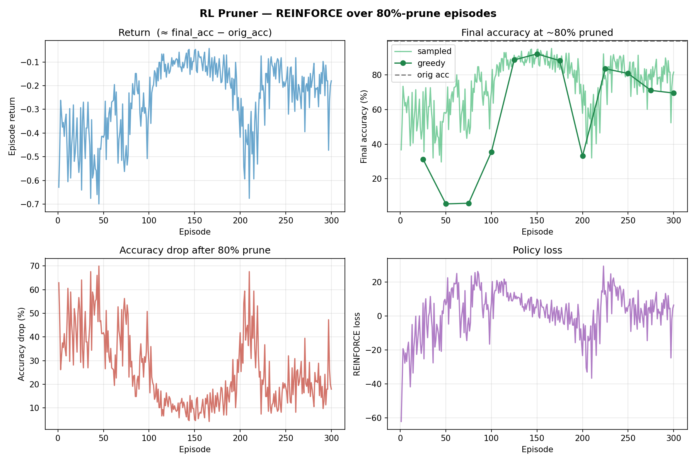

# RL Pruner — Experiment Write-up

## Setup

A frozen MLP `784 → 1024 → 1024 → 10` (eval-batch accuracy **99.61%**) is pruned
sequentially by a learned policy until 80% of its 2048 hidden neurons are gated
off. Each macro-step removes a chunk of 16 neurons; activations are recalibrated
every 5 steps. The reward at step *t* is

    r_t = acc_t − acc_{t−1}

so the episode return telescopes to `final_acc − orig_acc`. Returns are therefore
≤ 0 in this setting — the policy is trying to minimise how much accuracy it
gives up.

The policy is a small permutation-invariant key/query network (8 per-neuron
features + 3 global features → hidden 64). It is trained with REINFORCE: 300
episodes, lr 1e-3, entropy coef 0.01, EMA baseline (decay 0.95). Every 25
episodes we additionally evaluate a **greedy** rollout to track the
deterministic version of the same policy.

## Sampled vs Greedy Rollouts

Both rollouts use the same trained policy and the same logits at every step.
The only difference is how those logits are turned into a chunk of neurons to
prune.

| Rollout | How a chunk is selected | What it measures |
|---|---|---|
| **Sampled** | Draw 16 neurons via `multinomial(softmax(logits), k=16)` without replacement — neurons with higher logits are more likely, but anything with non-zero probability can be chosen. | Average behaviour of the stochastic policy. This is what REINFORCE actually optimises. Has run-to-run variance even with fixed weights. |
| **Greedy** | Take the top-16 logits exactly — `topk(softmax(logits), 16)`. No randomness. | Deterministic "best guess" of the policy. This is what you'd ship at inference. |

Why both matter:

- **Sampled** is the *training distribution*. Improvement on sampled return is
  the signal REINFORCE follows. If sampled acc rises, the policy is improving on
  average.
- **Greedy** is the *deployment distribution*. It tells you whether the
  argmax over the policy's distribution is any good — the part you'd actually
  use to prune a model in practice.

The two metrics agreeing means the policy has converged onto a clear preference
ordering: the highest-probability neurons really are the ones that survive
pruning. Disagreement means the policy is hedging — its peakier modes can be
high-quality, but the actual top-1 picks are not necessarily the right ones.
Specifically:

- **greedy ≪ sampled** (what we see late in training, ep 300: 69.5% vs 81.6%):
  the policy has *high entropy* — many neurons have similar probability, and
  the argmax often picks an unlucky one. Sampling occasionally rolls a good
  combination that argmax misses.
- **greedy ≫ sampled** would mean sampling injects too much noise into an
  otherwise sharp policy — usually not what we see; it indicates entropy
  regularisation is too high.
- **greedy ≈ sampled** is the goal: a confident policy whose argmax is robust.

## Results

Reading the four panels:

- **Top-left (Return):** sampled return per episode. Climbs from ≈ −0.63 at
  init (random policy ≈ 36% acc after 80% prune) toward ≈ −0.05 around ep 150
  (94.5% acc). Drops back later — classic REINFORCE variance.
- **Top-right (Final accuracy):** dashed line is the original 99.61%. Green
  curve is sampled final accuracy; circles are greedy evaluations. The two
  track each other in the middle of training (ep 120–160) — peak greedy 92.19%
  at ep 150 — but diverge at the end.
- **Bottom-left (Accuracy drop):** mirror of top-right. Best sampled drop is
  4.30% at ep 166 (95.31% final acc).
- **Bottom-right (REINFORCE loss):** signed surrogate loss. Sign flips track
  whether the current episode's return beat the EMA baseline; absolute size
  scales with advantage × log-prob.

### Headline numbers (80.5% of neurons pruned)

| Metric | Value |
|---|---|
| Original acc | 99.61% |
| Random-policy floor (ep 1) | 36.72% |
| Best sampled acc | **95.31%** (ep 166) |
| Best greedy acc | **92.19%** |
| Final sampled acc (ep 300) | 81.64% |
| Final greedy acc (ep 300) | 69.53% |

## Interpretation

The policy clearly learns. Compared to the random-init policy (36.7% acc at
80% pruned), the best learned policy retains **95.3%** of MNIST accuracy after
removing the same 80% of hidden neurons — a 58-point gain.

But REINFORCE is unstable here. Around ep 200 the policy collapses
(return down to −0.68), then recovers but never fully regains its earlier peak.
Two likely contributors:

1. **EMA baseline lag.** A single decaying scalar can't track changes in the
   return distribution; advantages are misestimated after a regime shift, and
   the policy chases noise.
2. **High entropy in the tail.** Sampled-vs-greedy diverges late
   (81.6% vs 69.5% at ep 300), suggesting the policy is keeping many neurons
   roughly equiprobable rather than committing.

### Next directions

- Add a learned value head (actor-critic / A2C) so advantages are
  per-state-and-step, not a single EMA.
- Switch to PPO with clipping to prevent the destructive policy updates that
  cause the ep 200 collapse.
- Anneal the entropy coefficient — high early, low late — to encourage
  decisiveness once the policy is good.
- Compare best greedy (92.19% at 80% pruned) against the BiLSTM hypernetwork
  pruner at the *same* sparsity budget, not the BiLSTM's natural ~50%.

## Files

- Plot: [rl_pruner.png](rl_pruner.png)  (also at ../experiments/latest/rl/reinforce/80/plot.png)
- Summary: [../experiments/latest/rl/reinforce/80/summary.txt](../experiments/latest/rl/reinforce/80/summary.txt)
- Run log: [../experiments/latest/rl/reinforce/80/run.log](../experiments/latest/rl/reinforce/80/run.log)
- Env: [../src/rl/env.py](../src/rl/env.py)
- Policy: [../src/pruners/rl_policy.py](../src/pruners/rl_policy.py)
- Training: [../src/rl/train.py](../src/rl/train.py), [../scripts/rl/train_rl_pruner.py](../scripts/rl/train_rl_pruner.py)
